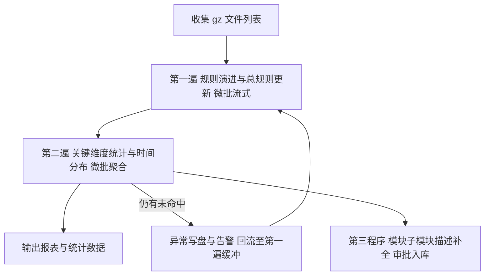
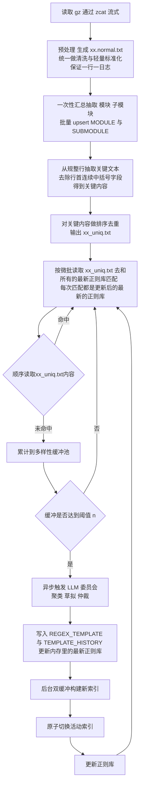
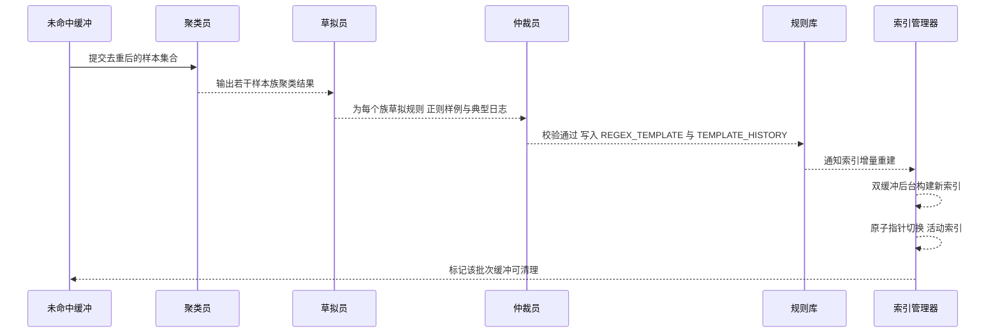
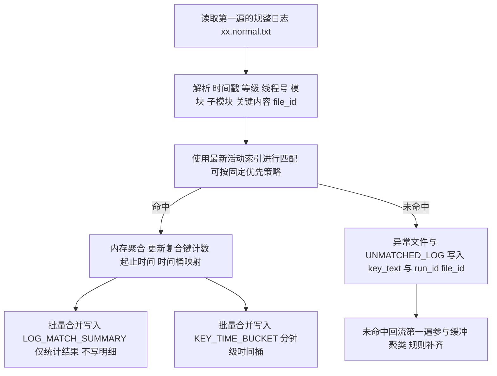
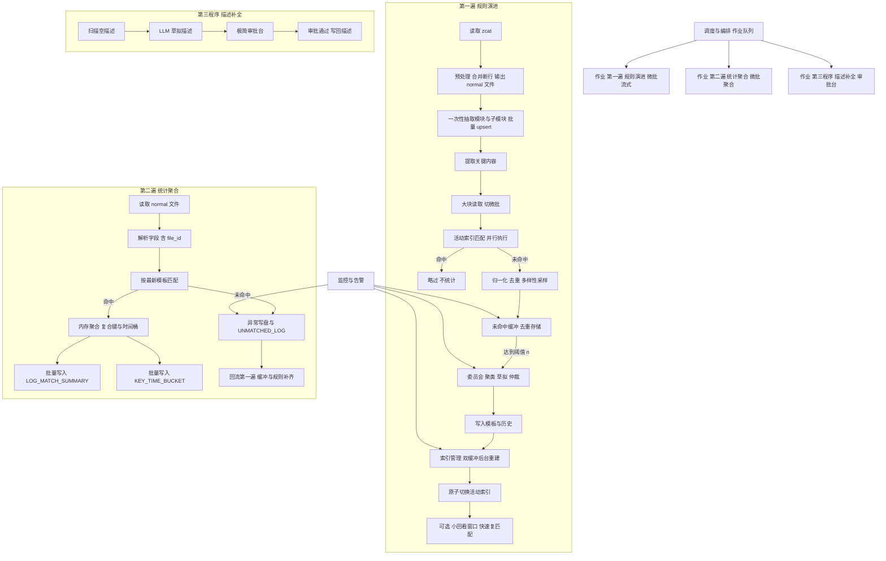
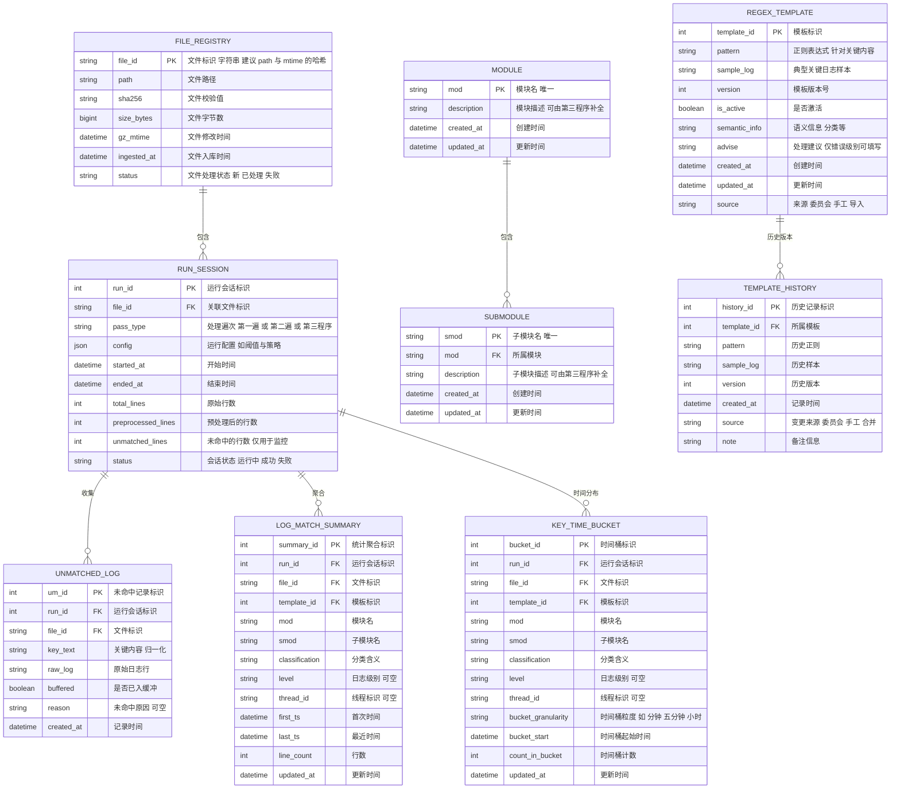

太好了！下面给出**融入“微批流式”机制后的完整方案**。我把你此前的全部设计与约束完整保留，并在第一遍中加入了「一次读大块、切成小批、并行匹配、阈值触发 LLM、索引双缓冲原子切换、可选小回看」的执行模型；其余部分只做必要增强，不改变你既有共识。整份方案**条理清晰、可落地、面向开发**。

---

# 一 总览与目标

* 处理每个 gz 日志包分两遍

  * **第一遍 规则演进与总规则更新**：高效更新 `MODULE` 与 `SUBMODULE` 基础表；对关键日志做**微批流式匹配**、仅在未命中达到阈值时触发 LLM 产出新模板；**即时热切换索引**，使**同一文件后续内容**立刻受益；不做统计。
  * **第二遍 关键维度统计**：基于最新模板，对规整日志做**微批匹配与内存聚合**，仅写入统计和时间分布；对未命中落盘并回流第一遍。
* **第三个程序 描述补全**：对 `MODULE` 与 `SUBMODULE` 的 `description` 为空的项，使用 LLM 草拟并提供极简审批 UI，便于人工快速确认。

> 约束：
>
> 1. `REGEX_TEMPLATE` 不包含 `mod` 与 `smod` 字段；模板作用域通过第二遍统计体现；
> 2. **去除** `TEMPLATE_APPLICABILITY` 与 `SUMMARY_TEMPLATE_APPLICABILITY`；
> 3. `UNMATCHED_LOG` 仅保存关键日志的必要信息，不含 `mod` `smod` `level` `thread_id` `timestamp`；
> 4. `file_id` 为**字符串**并出现在第二遍相关表中，便于多片段区分与并行处理；
> 5. `KEY_TIME_POINT` 默认为关闭，或设置短 TTL；**仅分钟级桶 `KEY_TIME_BUCKET` 为主**。

---

# 二 全局流程图



---

# 三 第一遍 规则演进与总规则更新（微批流式）

## 3.1 处理流程图



> 核心语义：**微批流式**保证「同一文件后续行」在新规则产出后**立刻受益**。
> 匹配并行、LLM 与索引构建全程**异步**，主循环**不中断**。

## 3.2 LLM 委员会时序图（V1 点 0 最小闭环）



> 说明：
>
> * 更高版本可加入**回归核查员**与**对抗验证员**，其中对抗验证员**从历史日志检索**近似负样本进行判伪，**不生成**合成样本。
> * 本版默认以 V1 点 0 运行，先跑通闭环，后续平滑扩展。

## 3.3 第一遍的 LLM 输出契约

* **输入**：n 条排序去重后的关键内容，可附带极少上下文
* **输出**：紧凑 JSON 数组，字段包括

  * `分类`
  * `推荐方案` 仅错误级别填写
  * `匹配规则`
  * `典型日志`
  * `mod`
  * `smod`
  * `出现次数`

> 入库映射：
>
> * `匹配规则` 写入 `REGEX_TEMPLATE.pattern`
> * `典型日志` 写入 `REGEX_TEMPLATE.sample_log`
> * `分类` 与 `推荐方案` 写入 `REGEX_TEMPLATE.semantic_info` 与 `REGEX_TEMPLATE.advise`
> * `mod` 与 `smod` 不写模板本体；后续仅通过第二遍统计体现其关联度

## 3.4 第一遍关键执行点

* **大块读取**：提升 IO 吞吐，建议 `chunk_lines 1万`
* **微批切分**：建议 `micro_batch_size 20` 并行匹配
* **多样性采样**：对未命中样本做归一化、哈希去重、SimHash 或 ngram 近似去重，挑选代表性样本入缓冲
* **缓冲阈值**：`n 约 100`，达到即触发 LLM 产出模板
* **索引双缓冲**：`Index_A` 提供读，后台构建 `Index_B`，**原子切换**指针
* **可选小回看**：在切换后对最近 `K` 个微批的未命中做一次新索引快速复匹配，默认关闭以保证吞吐
* **第一遍不统计**：只做规则演进，不写计数与时间分布

---

# 四 第二遍 关键维度统计与时间分布（微批聚合）

## 4.1 处理流程图



> 说明：
>
> * 第二遍仅写统计，不写逐行明细；
> * `KEY_TIME_POINT` 默认关闭或短期 TTL，仅用于临时钻取；
> * 所有统计表均包含 `file_id` 以区分多个片段和支持并行聚合。

## 4.2 微批聚合要点

* 与第一遍相同，使用 `chunk_lines` 加 `micro_batch_size` 提升吞吐
* 命中记录通过内存哈希聚合计数与时间范围，达到批量阈值后集中 upsert
* 未命中落盘并回流，不在第二遍触发 LLM

---

# 五 第三个程序 模块与子模块描述补全

* 扫描 `MODULE` 与 `SUBMODULE` 的 `description` 为空项
* 调用 LLM 草拟描述
* 提供极简 Web 审批台（建议 Streamlit 或 Gradio）
* 审批通过后写回数据库，支持批量和逐项

---

# 六 技术架构与数据流



---

# 七 数据库设计 与中文注释

> 说明：
>
> 1. `file_id` 为字符串，出现在第二遍涉及的表；
> 2. `REGEX_TEMPLATE` 不包含 `mod` 与 `smod`；
> 3. **无** `TEMPLATE_APPLICABILITY` 与 `SUMMARY_TEMPLATE_APPLICABILITY`；
> 4. `UNMATCHED_LOG` 仅保存关键内容、原始行与关联 id，不存无关字段；
> 5. `KEY_TIME_POINT` 默认关闭或短期 TTL。



> `KEY_TIME_POINT` 如需开启另建表并设置短 TTL，这里不再展开。

---

# 八 关键参数与默认值

* 第一遍

  * `read_chunk_lines: 10000`
  * `micro_batch_size: 20`
  * `match_workers_per_batch: 4 到 8`
  * `buffer.size_threshold_n: 100`
  * `buffer.max_per_micro_batch: 15`
  * `diversity.simhash_bits: 64`
  * `index.double_buffer: true`
  * `lookback.enabled: false`
  * `lookback.last_batches: 3`
* 第二遍

  * 同样的 `chunk` 与 `micro_batch`，批量 upsert 阈值按内存与事务耗时调整
  * `KEY_TIME_POINT` 默认关闭 或 TTL 极短

---

# 九 程序与目录结构建议

```
project_root/
  bin/
    p1_run_first_pass                # 第一遍入口 微批流式 规则演进与热更新
    p2_run_second_pass               # 第二遍入口 微批聚合 仅统计与时间桶
    p3_launch_description_ui         # 第三程序 审批台
  core/
    reader.py                        # 大块读取 切微批
    preprocessor.py                  # 合并断行 归一化
    parser.py                        # 字段解析 时间戳 等级 线程 模块 子模块 关键内容
    key_extract.py                   # 前缀中括号剥离 得到关键内容
    matcher.py                       # 并行匹配 命中与未命中结果
    buffer.py                        # 未命中缓冲 去重 多样性采样
    indexer.py                       # 索引双缓冲 原子切换 可选小回看
    committee.py                     # LLM 委员会 聚类 草拟 仲裁 与历史对抗检索
    templates.py                     # 模板写入与历史版本化
    aggregator.py                    # 第二遍内存聚合 复合键与时间桶
    monitor.py                       # 监控指标与告警钩子
  store/
    dao.py                           # 表建模 upsert 批量写入
    schema.sql                       # 建表脚本
  ui/
    review_app.py                    # 审批台 前端
  configs/
    application.yaml                 # 参数配置
  docs/
    runbook.md                       # 运维与排障
```

---

# 十 面向开发的函数清单（目标与调用关系）

> 仅列**目标与出入参**，不含实现代码，确保拿到即可开工。

### 10.1 第一遍

* `reader.read_in_chunks(path, chunk_lines) -> Iterable[List[str]]`
  目标：从 gz 或 normal 文件大块读取
  出参：每块行列表

* `preprocessor.normalize_lines(raw_lines) -> List[str]`
  目标：合并非时间戳开头行，输出一行一日志

* `parser.parse_fields(line) -> ParsedLine{ts, level, thread_id, mod, smod, key_text, raw}`
  目标：解析一行日志得到关键字段与关键内容

* `parser.collect_modules(parsed_lines) -> Set[mod], Set[smod]`
  目标：一次性抽取模块与子模块集合

* `store.dao.upsert_modules(mods), upsert_submodules(smods)`
  目标：批量写入 MODULE 与 SUBMODULE

* `reader.split_micro_batches(lines, size) -> List[List[str]]`
  目标：将大块切为微批

* `matcher.match_batch(index_handle, parsed_batch, workers) -> List[MatchResult{hit, key_text, raw}]`
  目标：并行匹配微批，返回逐行命中情况与 key_text

* `buffer.pick_for_buffer(misses, max_per_micro_batch) -> List[str]`
  目标：归一化、去重、近似去重与多样性采样，产出代表性未命中样本

* `buffer.add(samples) / buffer.reached_threshold(n) / buffer.snapshot_and_lock()`
  目标：管理未命中缓冲与阈值触发

* `committee.run(samples) -> List[RuleCandidate{pattern, sample_log, semantic_info, advise, mod, smod, occurrences}]`
  目标：调用聚类 草拟 仲裁 产出规则候选

* `templates.write_candidates(cands) -> List[template_id]`
  目标：写入 `REGEX_TEMPLATE` 与 `TEMPLATE_HISTORY`

* `indexer.build_new_index_async() -> IndexHandle`
  目标：后台构建新索引

* `indexer.atomic_switch(new_handle)`
  目标：原子切换活动索引指针

* `indexer.lookback_rematch_recent_unmatched(k_batches)`
  目标：可选小回看 轻量复匹配

### 10.2 第二遍

* `aggregator.aggregate_batch(matches) -> None`
  目标：更新内存聚合哈希表 计数与起止时间与时间桶

* `aggregator.flush_to_db() -> None`
  目标：批量 upsert 到 `LOG_MATCH_SUMMARY` 与 `KEY_TIME_BUCKET`

* `store.dao.write_unmatched(run_id, file_id, key_text, raw)`
  目标：记录未命中并落盘

### 10.3 第三程序

* `store.dao.find_modules_missing_desc() -> List[mod]`
* `store.dao.find_submodules_missing_desc() -> List[smod]`
* `llm.generate_description(name, examples) -> text`
* 审批台调用 `dao.update_module_desc(mod, desc)` 与 `dao.update_submodule_desc(smod, desc)`

---

# 十一 监控与告警

* **未命中率**：第一遍与第二遍分别统计，支持阈值告警
* **LLM 排队时延**：超时重试与熔断
* **索引切换耗时**：构建时长、切换次数
* **批量写入耗时**：写入失败告警
* **缓冲等待时间**：防止“新类长时间不被吸纳”

---

# 十二 性能与一致性建议

* 索引：模板较多时用**预筛选结构**加速（如 AhoCorasick 或前缀表）
* 事务：聚合写入采用 upsert 合并，控制批量大小
* 幂等：`file_id` 基于 `path+mtime` 哈希，`RUN_SESSION` 状态机保证可重入
* 热更新：**双缓冲**保障读路径无锁或极短临界区
* `KEY_TIME_POINT`：默认关闭或短 TTL，避免数据膨胀

---

# 十三 启动顺序与冷启动策略

* 可直接从 **p1 第一遍**开始；
* 冷启动期 LLM 触发频繁属于正常，新模板产出后立刻热生效，**同一文件后续行**命中率快速提高；
* 等模板库变厚后，LLM 自动降频到增量发现模式。

---

## 一句话收尾

这版方案已经把你提出的**“微批流式匹配与即时热更新”**无缝融入现有两遍流程，同时坚守“第一遍不统计、只演进规则”的原则；数据库、程序、函数、时序与参数全部给全，**拿去即可开工**。如果你愿意，我也可以把这份方案转换为 README 与建表 SQL、样例配置与脚本清单，便于团队直接落仓。
