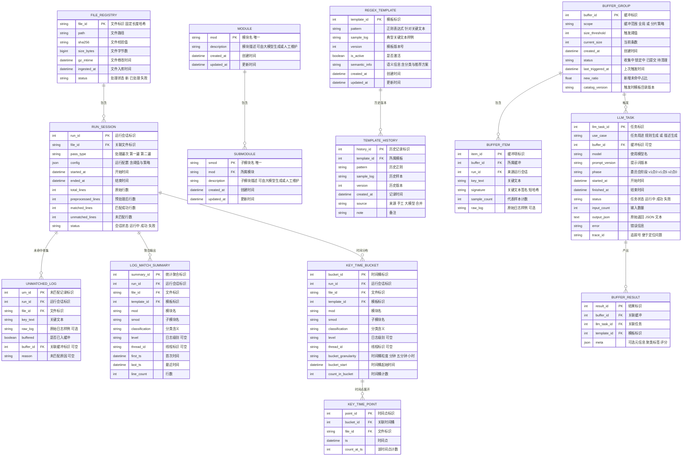

太好啦！下面给出一份**可以直接交给团队实现**的“施工级”方案补全，重点把**程序与函数的调用关系**、**函数设计与入参与出参**、**异常与回退**、**配置与监控**说细到能落地。
说明：Mermaid 图不含半角圆括号；数据库字段中文注释均用中文双引号；`file_id` 为固定长度字符串；索引使用**双缓冲原子切换**；`KEY_TIME_POINT` 默认关闭。

---

# 一 架构与程序清单


**程序与职责**

* `p0_bootstrap_seed_templates` 预热器 冷启动生成首批模板
* `p1_run_first_pass` 第一遍 规整 抽取 去重 缓冲与多智能体委员会 模板与索引热刷新
* `p2_run_second_pass` 第二遍 逐行匹配 内存聚合 批量落库 仅写统计与时间分布
* `p3_launch_description_ui` 极简 Web 审批台 人机协作补全 MODULE 与 SUBMODULE 的 description

---

# 二 核心流程与调用关系

## 2.1 第一遍 规则演进与索引热刷新

```mermaid
sequenceDiagram
    participant P1 as 第一遍主控
    participant ING as ingestion读取
    participant PRE as preprocess规整
    participant PAR as parser字段解析
    participant KEX as keyextract关键文本
    participant DED as dedup标准化去重签名
    participant MCH as matcher索引匹配
    participant BUF as buffer缓冲
    participant COM as committee多智能体
    participant TMP as templatemgr模板管理
    participant IDX as indexer双缓冲

    P1->>ING: "open_gz_stream"
    ING-->>PRE: "行流"
    PRE-->>PAR: "xxnormaltxt路径统计"
    PAR-->>KEX: "模块 子模块 抽取集合"
    P1->>TMP: "bulk_upsert_modules 与 submodules"
    KEX-->>DED: "关键文本序列"
    DED-->>MCH: "去重签名样本"
    MCH-->>P1: "命中样本 与 未命中样本"

    alt 存在未命中
        P1->>BUF: "buffer_unmatched 批量写入"
        BUF-->>P1: "buffer_status"
        P1->>COM: "should_trigger_committee 为真则 run_committee_phased"
        COM-->>TMP: "候选模板集合"
        TMP-->>IDX: "merge_templates_and_version"
        IDX->>IDX: "build_index_incremental"
        IDX-->>P1: "atomic_switch_index"
        P1->>BUF: "rematch_active_buffer_by_index_version"
    end
```

## 2.2 第二遍 逐行匹配与统计


## 2.3 第三个程序 描述审批台


## 2.4 预热器 冷启动


---

# 三 数据库模型与中文注释

> 与前版一致 仅列一次 生产按此建表



**唯一键**

* LOG_MATCH_SUMMARY
  `file_id, template_id, mod, smod, level, thread_id`
* KEY_TIME_BUCKET
  `file_id, template_id, mod, smod, level, thread_id, bucket_start, bucket_granularity`

---

# 四 Pydantic 模型与结构化入参出参

> 不贴代码，列模型字段供实现

**NormalFileMeta**

* file_id str 固定长度哈希
* path str
* sha256 str
* line_count int

**KeyItem**

* key_text str 标准化后关键文本
* signature str 短哈希
* sample_count int 代表样本计数

**MatchResult**

* matched list KeyItem
* unmatched list KeyItem

**BufferStatus**

* buffer_id int
* current_size int
* size_threshold int
* new_ratio float
* last_triggered_at datetime

**TemplateCandidate**

* pattern str
* sample_log str
* semantic_info str
* quality dict 包含 recall precision fp_rate 等

**UpsertReport**

* success int
* updated int
* skipped int
* failed int
* detail list str

**LineFields**

* ts datetime
* level str 可空
* thread_id str 可空
* mod str
* smod str
* key_text str

---

# 五 模块级函数设计 与入参出参

## 5.1 ingestion

* `open_gz_stream(path) -> Iterable[str]`

  * 入: gz 文件路径
  * 出: 行迭代器
  * 错: 文件不存在 权限 gzip 错误

## 5.2 preprocess

* `preprocess_to_normal(lines, file_id) -> NormalFileMeta`

  * 入: 行迭代器 file_id
  * 功: 合并非时间戳开头行 输出 `xx.normal.txt`
  * 出: NormalFileMeta
  * 旁: 记录 RUN_SESSION 与统计

## 5.3 parser

* `extract_mod_smod(normal_path) -> tuple[set[str], set[tuple[str,str]]]`
* `parse_line(line) -> LineFields`

  * 正则抽取 时间戳 等级 线程 模块 子模块 关键文本

## 5.4 templatemgr

* `bulk_upsert_modules(mods) -> UpsertReport`
* `bulk_upsert_submodules(pairs) -> UpsertReport`
* `merge_templates_and_version(candidates) -> list[int]`

  * 写 REGEX_TEMPLATE 与 TEMPLATE_HISTORY
  * 返回新模板 template_id 列表

## 5.5 keyextract

* `extract_key_texts(normal_path) -> list[str]`
* `normalize_and_sign(texts) -> list[KeyItem]`

  * 标准化 去噪 签名

## 5.6 matcher 与 indexer

* `match_templates(items, index_handle) -> MatchResult`
* `build_index_incremental(new_templates) -> IndexHandle`
* `atomic_switch_index(index_handle) -> str index_version`
* `rematch_active_buffer_by_index_version(index_version) -> int`

  * 返回缓冲中被覆盖清理的样本数

## 5.7 buffer

* `buffer_unmatched(items, run_id) -> BufferStatus`
* `should_trigger_committee(buffer_status, cfg) -> bool`
* `lock_buffer_group(buffer_id) -> list[KeyItem]`
* `release_buffer_group(buffer_id, cleaned_count) -> None`

## 5.8 committee 基于 LangGraph

* `run_committee_phased(samples, phase, trace_id) -> list[TemplateCandidate]`

  * V1点0 聚类 草拟 仲裁
  * V1点5 加回归核查
  * V2点0 加泛化与对抗
* `judger_early_stop(candidates, threshold) -> list[TemplateCandidate]`

## 5.9 aggregator 与 writer

* `agg_update(file_id, template_id, mod, smod, classification, level, thread_id, ts)`
* `agg_flush_summary(run_id) -> UpsertReport`
* `agg_flush_time_buckets(run_id, granularity) -> UpsertReport`
* `sink_unmatched(run_id, file_id, key_text, raw_log) -> None`

## 5.10 description ui

* `list_targets_with_missing_desc() -> list[dict]`
* `build_context_for_target(target) -> dict bullets`
* `suggest_desc_llm_if_empty(target) -> str`
* `apply_approved_desc_batch(list_items) -> UpsertReport`
* `launch_description_ui(bind_host, bind_port) -> None`

## 5.11 bootstrap

* `bootstrap_seed_templates(file_paths, phase) -> UpsertReport`

---

# 六 多智能体委员会 LangGraph 细化


**异常与回退**

* LLM 超时 重试三次 指数退避
* 输出格式不合规 自动降级至单智能体草拟
* 模板编译失败 该候选剔除并记入 BUFFER_RESULT meta
* 预算耗尽 早停返回当前最优子集

---

# 七 配置与策略

* `indexer.double_buffer.enabled true`
* `committee.phase v1点0 v1点5 v2点0`
* `committee.score_threshold 0.75`
* `buffer.size_threshold 100`
* `buffer.min_trigger_interval_sec 300`
* `p2.agg.batch_lines 1000`
* `time_point.enabled false`
* `time_point.ttl_days 3`
* `file_id.strategy sha256 path 加 gz_mtime 取前三十二位`

---

# 八 监控 与 告警

* 第一遍
  未命中率 缓冲触发次数 新模板数 索引构建与切换耗时 委员会早停占比
* 第二遍
  匹配命中率 批量 upsert 耗时 唯一键冲突率 每 file_id 写入批次数
* 审批台
  人工通过率 自动兜底占比 审批平均时延
* 告警
  未命中率连续上升 索引切换失败 LLM 超时过多 Upsert 冲突异常

---

# 九 实施顺序 与 验收

1. 建表与索引 生成 `file_id` 固定长度
2. 索引双缓冲与原子切换演练
3. 第一遍 V1点0 跑通 与缓冲阈值节流
4. 第二遍 聚合与批量 upsert 幂等验证
5. 预热器 批量生成首批模板 灰度生效
6. 审批台上线 人机协作补全描述
7. 监控看板与告警策略生效

**验收门槛**

* 同一 `file_id` 重跑幂等
* 新模板上线后 同类未命中显著下降 同批不再触发 LLM
* 原子切换期间零阻塞零崩溃
* `KEY_TIME_POINT` 默认关闭 无爆表风险
* 模块描述覆盖率达到目标 人工体验顺畅

---

## 总结

这份补全把**程序与函数的调用关系**、**函数目标与入参与出参**、**多智能体协作图**、**数据库与唯一键**、**索引双缓冲**和**异常回退**全部落到了**工程实施颗粒度**。一个不相干的开发者拿到即能按图施工，从预热器到两遍主链路再到审批台，快速拼装上线并稳定迭代。
