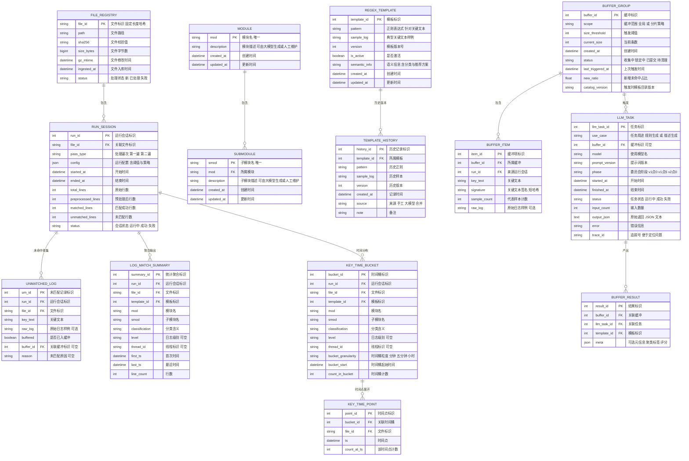

没问题！下面是一份**可直接交付给团队落地的施工级方案**。内容覆盖程序设计思路、模块与函数清单、调用链路、数据库表与注释、智能体协作与历史样本对抗验证、索引双缓冲、配置与监控、验收与演练。
说明要点

* 全文中文简体
* 所有 Mermaid 图不含半角圆括号
* 数据库字段中文注释使用中文双引号
* 模板匹配仅针对关键文本
* 对抗验证只从历史日志检索真实样本 不生成样本
* 第一遍只做规整 抽取 模板演进 与索引热刷新 不做统计
* 第二遍逐行匹配与聚合 仅写统计与时间分布
* 第三个程序补充模块与子模块描述 人机协作可审可改
* 多智能体采用 LangGraph LangChain langchain openai Pydantic

---

# 一 总览与主流程


---

# 二 第一遍 规则演进 与 索引双缓冲

目标

* 高吞吐读取 gz
* 合并断行 得到一行一日志的 xx normal txt
* 快速正则抽取模块与子模块 去重后批量入库
* 提取关键文本 标准化 排序去重
* 使用当前活跃索引匹配 未命中进入缓冲 达阈值触发智能体
* 智能体生成新模板 落库并写历史版本
* 以双缓冲重建索引 后台原子切换 不中断读链路
* 旁路写入关键文本语料分片 供历史对抗验证检索


---

# 三 多智能体委员会 LangGraph 方案

阶段演进

* v1点0 聚类员 草拟员 仲裁员
* v1点5 加入回归核查员
* v2点0 再加入泛化员 与 历史回放对抗验证员
  说明
* 对抗验证员只从历史语料检索相似與硬负样进行评测 不生成样本


智能体关键点

* LangGraph 有向图 驱动多轮对话
* LangChain 工具与模型路由
* Pydantic 严格校验候选模板结构
* 异常处理 超时重试 指数退避 输出不合规降级为单智能体草拟
* 预算控制 触发早停 返回当前最优子集

---

# 四 第二遍 逐行匹配 与 统计落库

目标

* 读取第一遍产出的 xx normal txt
* 解析字段与关键文本
* 使用活跃索引与模板匹配
* 命中在内存聚合 以复合键统计与时间桶
* 达批量阈值后批量 upsert
* 未命中落盘并回流到第一遍补齐
* 不写逐行明细 只写聚合与时间分布


---

# 五 第三个程序 模块描述审批台

目标

* 扫描 MODULE 与 SUBMODULE 描述为空
* 构造上下文要点 自动生成草案 人可修改与一键通过
* 批量写回数据库 持续完善说明文本
  建议
* 使用 Streamlit 或 Gradio 极简界面
* 记录审批与兜底调用到 LLM_TASK


---

# 六 历史样本检索 用于对抗与回归

设计

* 第一遍在关键文本排序去重之后 旁路写入语料分片 与轻量索引
* 轻量索引建议 SQLite FTS 或内存倒排索引 可选小型嵌入库
* 对抗验证仅从历史库检索真实相似样本
* 评测在正样上测召回 在硬负上测误杀

语料与索引

* 语料分片

  * 路径 corpus/YYYYMMDD/file_id.txt
  * 行格式 signature 制表 key_text
  * 同签名去重 保留代表样本及计数
* 轻量索引

  * 默认 SQLite FTS5 索引库 corpus_index.db
  * 字段 signature key_text last_seen file_id
  * 可替换为内存 trigram 倒排索引
* 检索策略

  * 以候选模板代表 token 召回 TopK
  * 基于编辑距离與 Jaccard 过滤出近邻硬负样
  * 传回回归核查员与对抗验证员评测
* KEY_TIME_POINT 默认关闭 仅钻取时临时开启 且配置短 TTL

---

# 七 数据库模型 与中文注释



唯一键建议

* LOG_MATCH_SUMMARY
  file_id template_id mod smod level thread_id
* KEY_TIME_BUCKET
  file_id template_id mod smod level thread_id bucket_start bucket_granularity

---

# 八 程序与目录结构

```
bin
  p0_bootstrap_seed_templates
  p1_run_first_pass
  p2_run_second_pass
  p3_launch_description_ui
core
  ingestion
  preprocess
  parser
  keyextract
  dedup
  matcher
  indexer
  buffer
  committee
  corpus
  llm
  templatemgr
  aggregator
  writer
  monitor
store
  dao
  ddl
  migrations
configs
  application.yaml
  committee.yaml
  writer.yaml
  models.yaml
```

---

# 九 函数清单 目标 入参 出参 调用逻辑

下列为实现用的函数契约 摘要无代码

## 9点1 第一遍主链路

* open_gz_stream
  目标 流式读取 gz
  入 path
  出 行迭代器
  异常 文件权限与 gzip 错误

* preprocess_to_normal
  目标 合并非时间戳开头的行 输出 xx normal txt
  入 行迭代器 file_id
  出 NormalFileMeta
  副作用 写 RUN_SESSION 起止与统计

* extract_mod_smod
  目标 快速正则抽取模块与子模块 去重
  入 normal_path
  出 set_mods set_pairs

* bulk_upsert_modules bulk_upsert_submodules
  目标 批量写模块与子模块基础表 幂等
  入 集合
  出 UpsertReport

* extract_key_texts
  目标 跳过前缀方括号 提取关键文本
  入 normal_path
  出 文本列表

* normalize_and_sign
  目标 标准化 去噪 签名
  入 文本列表
  出 KeyItem 列表 包含 key_text signature sample_count

* corpus_append_shard corpus_index_upsert
  目标 异步写语料分片 与 轻量索引
  入 file_id KeyItem 列表 或 shard 路径
  出 报告

* match_templates
  目标 使用活跃索引与模板匹配
  入 KeyItem 列表 index_handle
  出 MatchResult matched 与 unmatched

* buffer_unmatched should_trigger_committee lock_buffer_group release_buffer_group
  目标 未命中缓冲管理 与触发策略
  入 unmatched run_id 或 buffer_id
  出 BufferStatus 与样本集

* run_committee_phased
  目标 按阶段调用聚类 草拟 仲裁 回归 泛化 对抗
  入 KeyItem 列表 phase trace_id
  出 TemplateCandidate 列表

* merge_templates_and_version
  目标 写 REGEX_TEMPLATE 与 TEMPLATE_HISTORY
  入 候选模板
  出 新模板 template_id 列表

* build_index_incremental atomic_switch_index rematch_active_buffer_by_index_version
  目标 双缓冲索引的构建 切换 与缓冲重匹配
  入 新模板集合 或目标版本
  出 新索引版本字符串 与清理数

## 9点2 多智能体相关

* cluster_samples
  目标 文本聚类
  入 KeyItem 列表
  出 簇到代表样本映射

* draft_regex_candidates
  目标 从代表样本草拟规则
  入 簇代表样本
  出 TemplateCandidate 列表

* judge_quality_early_stop
  目标 仲裁质量门限与早停
  入 候选集合 阈值
  出 通过集合 或回退信号

* regression_validate_on_history
  目标 历史窗口回放
  入 候选模板 历史窗口
  出 QualityReport

* fetch_history_neighbors
  目标 从语料检索近邻样本
  入 查询文本或 token top_k
  出 KeyItem 列表

* adversarial_eval_from_history
  目标 基于历史近邻进行对抗评测
  入 候选模板 历史正样与硬负样
  出 QualityReport

## 9点3 第二遍与写库

* iter_normal_lines parse_line
  目标 读取与字段解析
  入 file_id or path
  出 LineFields ts level thread mod smod key_text

* index_match
  目标 按活跃索引匹配
  入 key_text
  出 template_id 或空

* agg_update agg_flush_summary agg_flush_time_buckets
  目标 内存聚合与批量 upsert
  入 复合键 与 run_id
  出 UpsertReport

* sink_unmatched
  目标 未命中落盘与入表
  入 run_id file_id key_text 原始样例
  出 无

## 9点4 第三个程序

* list_targets_with_missing_desc
  目标 找到描述为空的模块与子模块
  出 目标列表

* build_context_for_target
  目标 汇总要点与典型样例
  入 目标标识
  出 Bullets 与建议草案

* suggest_desc_llm_if_empty
  目标 空缺兜底生成
  入 目标
  出 文本草案

* apply_approved_desc_batch
  目标 批量写回描述
  入 审批后的内容列表
  出 UpdateReport

---

# 十 索引双缓冲 与并发安全

* 内存保留 Index_A 活跃读
* 后台构建 Index_B
* 完成后原子指针切换
* 切换后对活动缓冲轻量重匹配 清理已覆盖未命中
* 读链路无锁 与高吞吐

---

# 十一 配置建议

* buffer size_threshold 一百
* buffer min_trigger_interval_sec 三百
* committee phase 缺省 v1点0 支持 v1点5 v2点0
* committee score_threshold 零点七五
* indexer double_buffer enabled true
* p2 agg batch_lines 一千
* time_point enabled false ttl_days 三
* file_id 由 path 与 gz_mtime 的 sha256 前三十二位
* corpus enabled true index type fts top_k 二百

---

# 十二 监控与告警

* 第一遍 未命中率 缓冲触发次数 新模板数 索引构建与切换耗时 委员会早停率
* 第二遍 命中率 批量 upsert 耗时 唯一键冲突率 每 file_id 写入批次数
* 审批台 人工通过率 自动兜底占比 平均审批耗时
* 历史检索 QPS P95 覆盖率 对抗后 fp 降幅
* 告警 未命中率连续上升 索引切换失败 LLM 超时多发 Upsert 冲突异常

---

# 十三 演练与验收

演练顺序
1 建表与索引 上线 file_id 固定长度
2 预热器生成首批模板 灰度
3 第一遍 v1点0 跑通 观察未命中与触发频率
4 开启双缓冲索引 切换演练
5 第二遍批量 upsert 幂等对比
6 审批台上线 完成描述补全
7 视情况开启 v1点5 与 v2点0 逐步加入回归与历史对抗

验收门槛

* 同一 file_id 重跑幂等
* 新模板上线后 同类未命中显著下降 同批不再触发 LLM
* 切换期间零阻塞
* KEY_TIME_POINT 默认关闭 无爆表风险
* 模块描述覆盖率达标 人工体验顺畅
* 对抗验证仅使用历史日志样本 质量指标达标

---

## 结语

这份方案已经把**程序设计 思路与模块职责 函数入出参与调用顺序 数据库约束 智能体协作 历史对抗检索 双缓冲索引 配置监控 验收演练**都铺平到可施工细度。团队按此拆分模块并行开发 即可快速落地并逐步演进到高质量全自动规则库。
