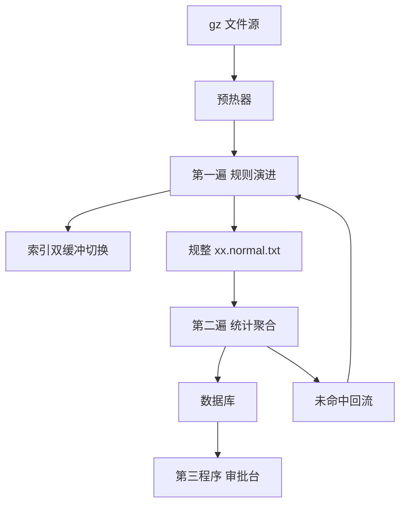

# 设计文档

```mermaid
graph TD
  SRC[gz 文件源] --> P0[预热器]
  P0 --> P1[第一遍 规则演进]
  P1 --> IDX[索引双缓冲切换]
  P1 --> NORM[规整 xx.normal.txt]
  NORM --> P2[第二遍 统计聚合]
  P2 --> DB[数据库]
  DB --> P3[第三程序 审批台]
  P2 --> FEED[未命中回流]
  FEED --> P1
```
