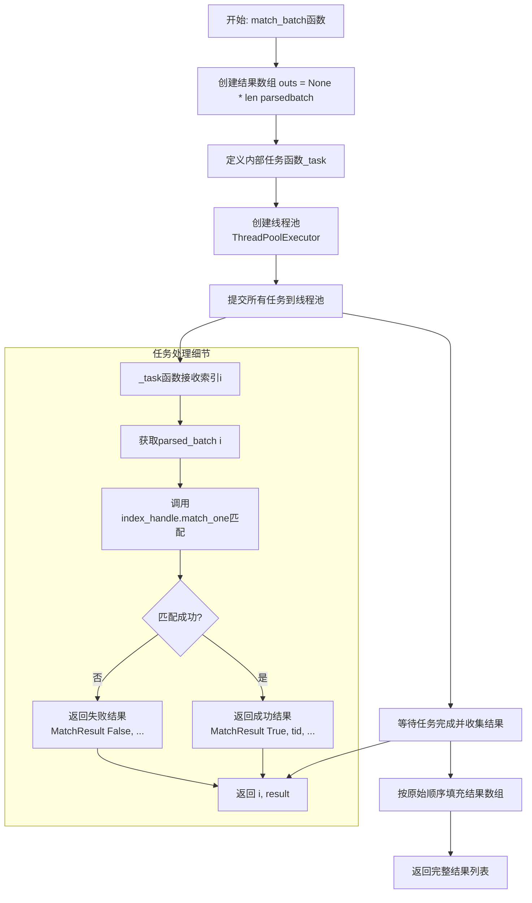
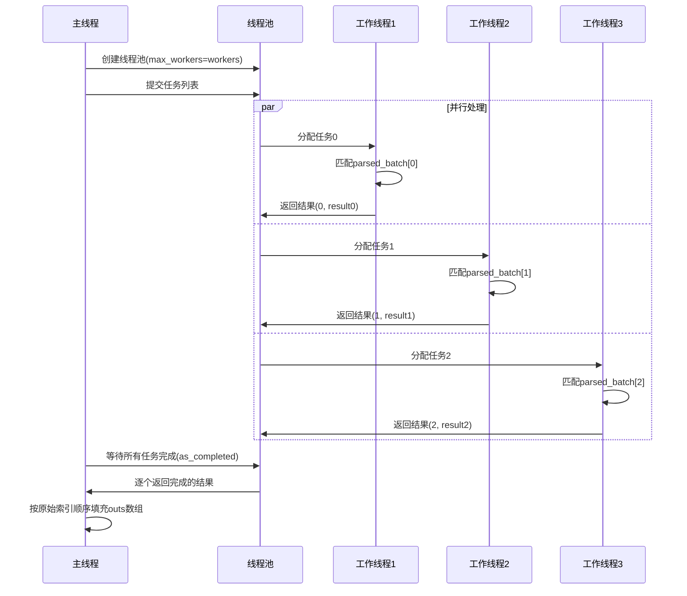
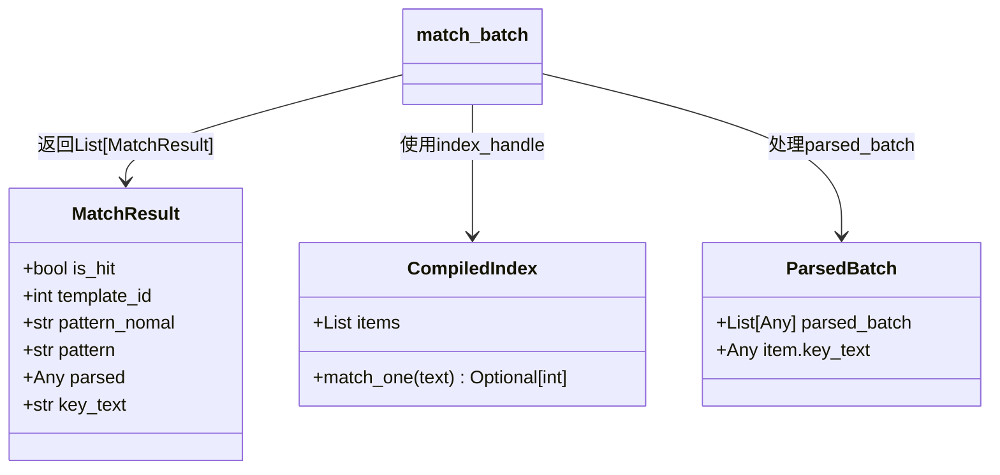

# match_batch 函数详细解释

## 🎯 函数概览

`match_batch` 函数是一个**批量匹配处理函数**，它的主要任务是：
- 一次性处理多个待匹配的文本项目
- 使用多线程并行提高处理效率
- 返回每个项目的匹配结果

## 📋 函数参数说明

| 参数名 | 类型 | 说明 |
|--------|------|------|
| `index_handle` | `CompiledIndex` | 预编译的索引对象，包含了所有匹配模板 |
| `parsed_batch` | `List[Any]` | 待处理的批量数据列表 |
| `workers` | `int` | 线程池大小，默认为1（单线程） |
| `nomal` | `bool` | 是否使用标准模式，默认为True |

## 🔄 主要流程图



## 🧵 多线程工作原理图



## 📊 数据结构图



## 🔍 详细代码解释

### 1. 初始化结果数组
```python
outs: List[MatchResult] = [None] * len(parsed_batch)  # type: ignore
```
- 创建一个与输入数据同样大小的空列表
- 用来存储每个项目的匹配结果
- `[None] * len(parsed_batch)` 快速创建指定长度的列表

### 2. 定义任务函数
```python
def _task(i):
    p = parsed_batch[i]  # 获取第i个待处理项目
    tid = index_handle.match_one(p.key_text)  # 尝试匹配
    if tid is None:
        # 匹配失败，返回失败结果
        return i, MatchResult(False, None, None, None, p, p.key_text)
    else:
        # 匹配成功，返回成功结果和模板ID
        return i, MatchResult(True, tid, None, None, p, p.key_text)
```

### 3. 多线程执行
```python
with ThreadPoolExecutor(max_workers=workers) as ex:
    # 提交所有任务到线程池
    futs = [ex.submit(_task, i) for i in range(len(parsed_batch))]
    
    # 等待任务完成并收集结果
    for fu in as_completed(futs):
        i, res = fu.result()  # 获取任务结果
        outs[i] = res  # 按原始索引位置存储结果
```

## 🎯 关键设计要点

### 为什么要用多线程？
- **并行处理**：多个项目可以同时进行匹配，提高整体速度
- **资源利用**：充分利用CPU的多核心能力
- **可配置性**：通过 `workers` 参数控制并发度

### 为什么返回索引和结果？
```python
return i, MatchResult(...)
```
- **保持顺序**：由于多线程完成顺序不确定，需要索引来正确排序
- **位置对应**：确保输出结果与输入项目一一对应

### MatchResult 的含义
- `is_hit: False` → 没有匹配到任何模板
- `is_hit: True` → 成功匹配，`template_id` 是匹配到的模板ID

## 📈 执行示例

假设有3个待处理项目，使用2个工作线程：

```mermaid
gantt
    title 多线程执行时间线
    dateFormat X
    axisFormat %s
    
    section 主线程
    创建线程池     :0, 1
    提交任务       :1, 2
    等待结果       :2, 8
    整理结果       :8, 9
    
    section 工作线程1
    处理项目0     :2, 4
    处理项目2     :4, 6
    
    section 工作线程2
    处理项目1     :2, 5
```



## 💡 小白理解要点

1. **批处理**：就像一次性洗很多碗，而不是一个一个洗
2. **多线程**：就像有多个人同时洗碗，每个人洗自己的碗
